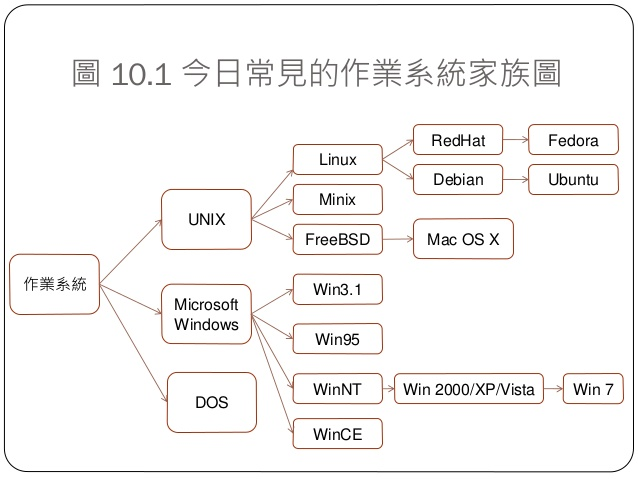

# 第十週上課筆記-Thread + OS



* 五大功能模組
```
    行程管理
    記憶體管理
    輸出入管理
    檔案管理
    使用者介面
```

* norace.c 程式碼

```
#include <stdio.h>
#include <pthread.h>

pthread_mutex_t mutex1 = PTHREAD_MUTEX_INITIALIZER;
#define LOOPS 100000
int counter = 0;

void *inc()
{
  for (int i=0; i<LOOPS; i++) {
    pthread_mutex_lock( &mutex1 ); 
    counter = counter + 1;          
    pthread_mutex_unlock( &mutex1 ); 
  }
  return NULL;
}

void *dec()
{
  for (int i=0; i<LOOPS; i++) {
    pthread_mutex_lock( &mutex1 );
    counter = counter - 1;          
    pthread_mutex_unlock( &mutex1 );
  }
  return NULL;
}


int main() 
{
	pthread_t thread1, thread2;

	pthread_create(&thread1, NULL, inc, NULL);
  pthread_create(&thread2, NULL, dec, NULL);

  pthread_join( thread1, NULL);
  pthread_join( thread2, NULL);
  printf("counter=%d\n", counter);
}
```
## 排程器
* 版本
```
任務計劃1

任務計劃程式1.0搭載於Windows 2000、Windows XP和Windows Server 2003。
它執行為一個Windows服務，任務定義和計劃儲存於二進位的.job檔案，操作各任務就是直接操作各.job檔案，每個任務對應一個操作。
在Windows 95、Windows 98和Windows Me中，任務計劃程式使用一個普通的mstask.exe程式執行。
在Windows 95和Windows 98中，它還在通知區域顯示一個狀態圖示；在Windows Me中則是執行為一個隱藏服務，但可以顯示一個托盤圖示。
任務計劃程式除了控制台中的圖形化使用者介面，Windows還提供兩個命令列工具來管理工作排程器：at.exe（已棄用）和schtasks.exe。

```
```
任務計劃2

在Windows Vista、Windows Server 2008及之後版本中存在。
重新設計的「任務計劃程式」使用者介面基於微軟管理控制台。
除了在指定的時間或時間間隔後執行任務，任務計劃程式2.0還支援行事曆和基於事件的觸發器，比如在特定紀錄檔被記錄到事件紀錄檔時啟動一個任務，或者在發生一系列事件時啟動任務。
另外，同一個事件觸發的多個任務可以組態為同時或者按預先組態的順序以鏈式執行一系列動作，而無須建立多個工作排程器。任務也可組態為基於系統狀態執行，諸如閒置指定時間、啟動時、登出時，或者只是特定周期或指定時間。對Windows事件紀錄檔還可以使用XPath表達式過濾。

任務計劃程式2.0提供了一個API以允許電腦程式和指令碼建立任務。
它採用42個COM介面組成。任務計劃程式2.0的任務檔案基於XML並且人類可讀，遵循「任務計劃程式方案架構」。
雖然可以做到，但微軟不建議手動建立任務檔案，而應該使用任務計劃程式API。
```
* 其他功能
```

新的安全功能，包括使用「憑據管理器」為工作群組電腦的任務提供密碼，使用Active Directory為加入域的電腦的任務提供憑據，以防止這些資訊被輕易檢索。另外，工作排程器會在其自身的對談執行，而不是使用當前使用者的系統服務對談。
可以喚醒遠端電腦，或使用BIOS計時器將機器從睡眠或休眠中喚醒，以執行工作排程器或執行剛錯過的工作排程器。
可以將任務直接附加到事件檢視器中的事件。
```
## 其他補充
* [RISC-V](https://github.com/riscv/riscv-gnu-toolchain?fbclid=IwAR1PuGVAjUWpBHDo7lk3LR-uqyNiZQXxQjkeYYja1p-rtjoB5hv--Au4uA0)