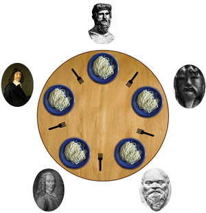

# 第十一週上課筆記-fork/fs/memory/Thread/Process/io

## 生產者消費者問題
* 生產者消費者問題，也稱有限緩衝問題
```
共享固定大小緩衝區的兩個進程——即所謂的「生產者」和「消費者」——在實際運行時會發生的問題。
生產者的主要作用是生成一定量的數據放到緩衝區中，然後重複此過程。
與此同時，消費者也在緩衝區消耗這些數據。
該問題的關鍵就是要保證生產者不會在緩衝區滿時加入數據，消費者也不會在緩衝區中空時消耗數據。
要解決該問題，就必須讓生產者在緩衝區滿時休眠（要麼乾脆就放棄數據），等到下次消費者消耗緩衝區中的數據的時候，生產者才能被喚醒，開始往緩衝區添加數據。
```
* 程式碼-wakeup
```
int itemCount = 0;

procedure producer() {
    while (true) {
        item = produceItem();
        if (itemCount == BUFFER_SIZE) {
            sleep();
        }
        putItemIntoBuffer(item);
        itemCount = itemCount + 1;
        if (itemCount == 1) {
            wakeup(consumer);
        }
    }
}

procedure consumer() {
    while (true) {
        if (itemCount == 0) {
            sleep();
        }
        item = removeItemFromBuffer();
        itemCount = itemCount - 1;
        if (itemCount == BUFFER_SIZE - 1) {
            wakeup(producer);
        }
        consumeItem(item);
    }
}
```
## 哲學家就餐問題
是在電腦科學中的一個經典問題，用來演示在並行計算中多執行緒同步時產生的問題。
一個同步問題，即假設有五台電腦都試圖存取五份共享的磁帶驅動器，這個問題可以用來解釋死結和資源耗盡。



* 說明
```
假設有五位哲學家圍坐在一張圓形餐桌旁，做以下兩件事情之一：吃飯，或者思考。
吃東西的時候，他們就停止思考，思考的時候也停止吃東西。
餐桌中間有一大碗義大利麵，每位哲學家之間各有一支餐叉。因為用一支餐叉很難吃到義大利麵，所以假設哲學家必須用兩支餐叉吃東西。
他們只能使用自己左右手邊的那兩支餐叉。
哲學家就餐問題有時也用米飯和五根筷子而不是義大利麵和餐叉來描述，因為吃米飯必須用兩根筷子。
這個問題不考慮義大利麵有多少，也不考慮哲學家的胃有多大。假設兩者都是無限大。
問題在於如何設計一套規則，使得在哲學家們在完全不交談，也就是無法知道其他人可能在什麼時候要吃飯或者思考的情況下，可以在這兩種狀態下永遠交替下去。

```

## 其他補充
* [生產者消費者問題](https://zh.wikipedia.org/wiki/%E7%94%9F%E4%BA%A7%E8%80%85%E6%B6%88%E8%B4%B9%E8%80%85%E9%97%AE%E9%A2%98?fbclid=IwAR1P79azbgRm0nN9cjLCT8MNbNs-DBeKXcVUiGFMaeHEhDyie9rwImnJxKU)
* [淺談I/O Model](https://medium.com/@clu1022/%E6%B7%BA%E8%AB%87i-o-model-32da09c619e6)
* [非同步程式設計和 non-blocking IO](https://medium.com/@fcamel/%E9%9D%9E%E5%90%8C%E6%AD%A5%E7%A8%8B%E5%BC%8F%E8%A8%AD%E8%A8%88%E5%92%8C-non-blocking-io-a43881081aac)
* [緩衝區溢位](https://zh.wikipedia.org/wiki/%E7%BC%93%E5%86%B2%E5%8C%BA%E6%BA%A2%E5%87%BA?fbclid=IwAR3ZtBgLK4ZVZIb8NSq5UGRnd-EWf1RXrjswOItgjuUeUSkHHyuQ1SPZW4k)
* [緩衝區溢位攻擊之一](https://medium.com/@ktecv2000/%E7%B7%A9%E8%A1%9D%E5%8D%80%E6%BA%A2%E4%BD%8D%E6%94%BB%E6%93%8A%E4%B9%8B%E4%B8%80-buffer-overflow-83516aa80240)
* [Linux manual page](https://man7.org/linux/man-pages/man2/pipe.2.html?fbclid=IwAR07sm0gCA4DQmWWz9P2ECZtMDa2jfx23z_-8JmE7ThxfwYeEWwopt1YRhE)
* [fork的原理](https://zhuanlan.zhihu.com/p/36872365?fbclid=IwAR38KRoaGziwb5WXe9At25ODDEnyqFpQq6YQv4Rro7JKfzWAoyrUAyLWBLI)