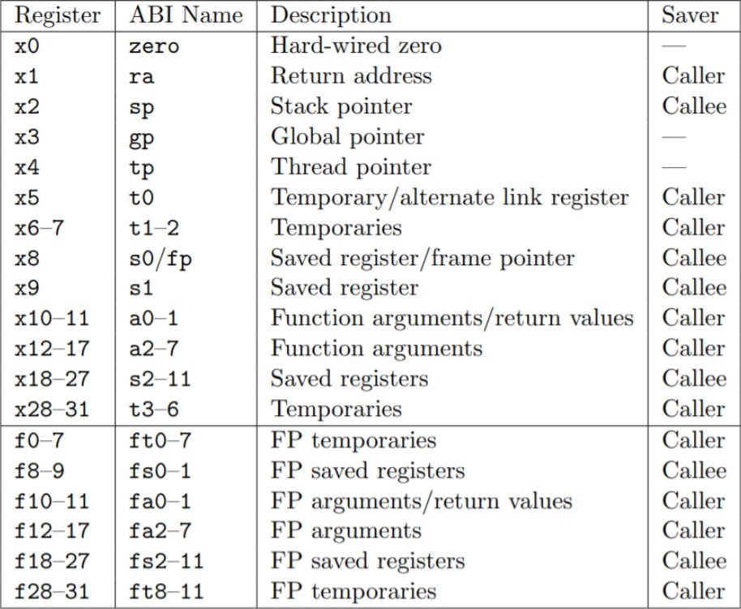
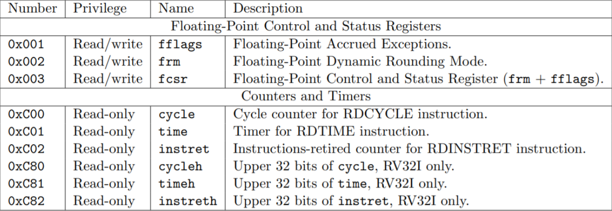
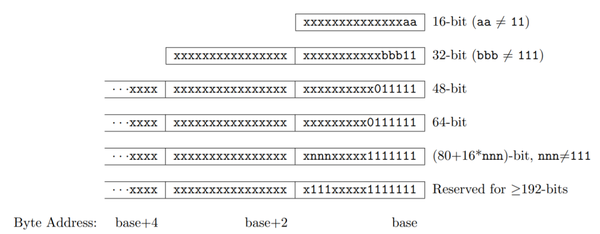

# 第十七週上課筆記-ISC-V 處理器與嵌入式系統

## RISC-V 處理器
* RISC-V 處理器的架構
```
RISC-V 處理器內含 32 個整數暫存器 (x0-x31)，若掛上浮點運算單元，則會再多出 32 個浮點暫存器 (f0-f31)。
```
 

```
這些暫存器通常有個比較好記的別名 (ABI Name)，例如 x0 的別名為 Zero，因為該暫存器為唯讀，而且數值永遠都是 0。 x1 又稱 ra (return address) ，因為用來儲存返回位址。x2 又稱 sp (stack pointer) ，是堆疊暫存器。
另外有些暫存器的別名是一整群的，例如 t1-t6 (temporaries) 都是臨時變數暫存器。 a0-a7 為參數暫存器 (arguments)，s0-s11 則是 Saved Registers。
還有一個重要暫存器沒有被列入上表，那就是 PC (Program Counter) ， RISC-V 的 PC 不屬於 x0-x31 ，而是一個獨立的暫存器，一般指令無法存取，想要讀取 PC 得用 auipc 這樣的特殊指令。
除了這些基本暫存器之外，RISC-V 還定義一群控制暫存器 CSR (Control Status Registers)，以下是已經固定下來的 CSR 暫存器。
```

 

* RISC-V 指令集

```
RV32I：基礎整數指令集 (固定不變了)
RV32M：乘法和除法
RV32F：單精度浮點操作（和 RV32D:雙精度浮點操作）
RV32A：原子操作
RV32C：可選的壓缩擴展 (對應 32 位元的 RV32G)
RV32B：基本擴展。
RV32V：向量擴展（SIMD）指令
RV64G：RISC-V 的 64 位地址版本。
```

* 壓縮指令集

```
為了讓 RISC-V 處理器具有商業競爭力，所以指令集支援了壓縮模式 RV32C，其中很多指令都可以被壓縮表達為 16 位元模式，只要最低的兩個位元 aa 不是 11，哪麼就是壓縮的 16 位元指令。
```
 

## 安裝
* https://github.com/riscv/riscv-gnu-toolchain
* https://www.sifive.com/software

## 其他補充
* [從計算機結構到作業系統](https://gitlab.com/ccc109/sp/-/tree/master/10-riscv)
