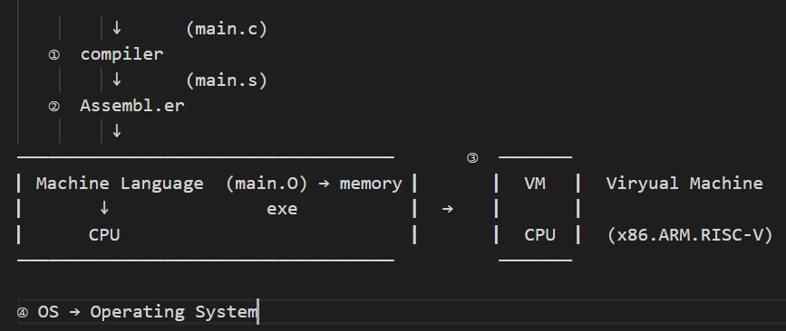
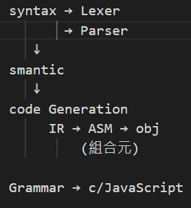
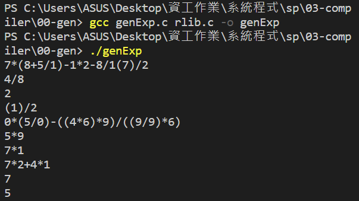
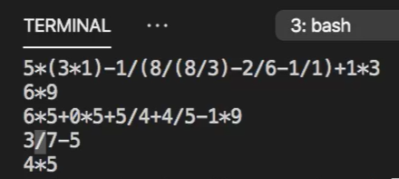
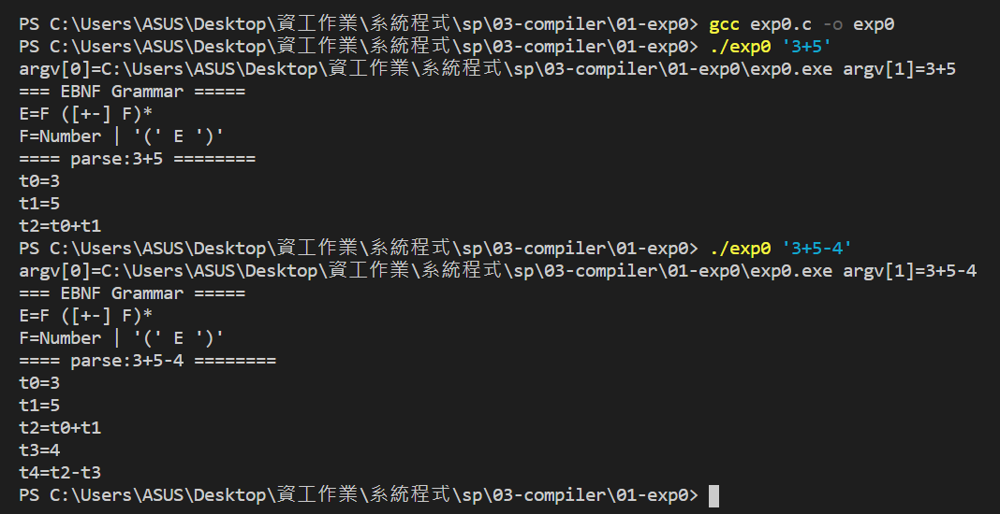
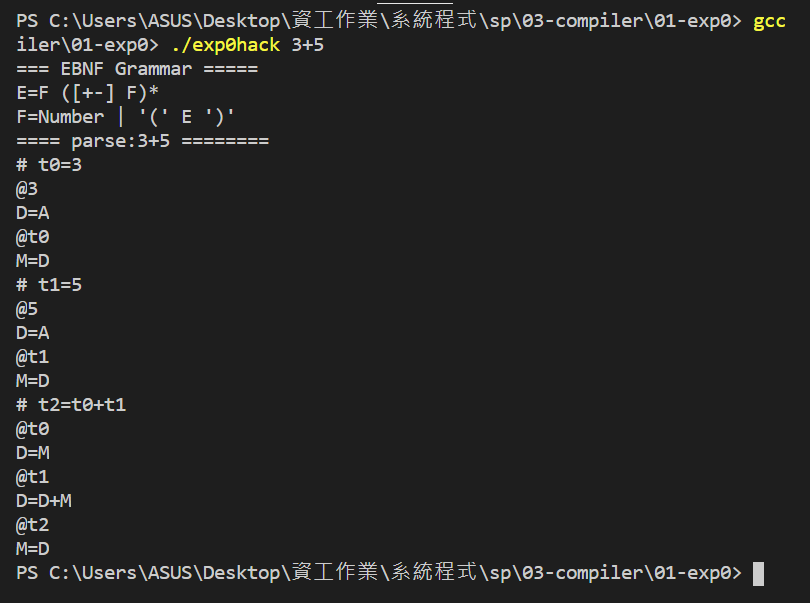

# 第二週上課筆記-編譯器

## 上課前簡介
  
①compiler
 

## 上課實作

 

 

 

## 其他補充
* [延伸補充教材](https://www.slideshare.net/ccckmit/ss-15898210?fbclid=IwAR2PND1_8cH_epVw7siL_JfUtffbO4o3TsPKhXwzkz6iSy_uA0x38P0koYE)