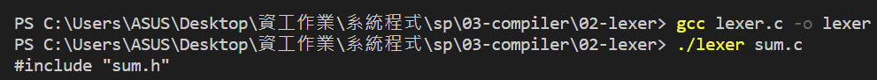
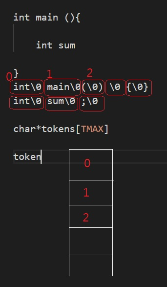

# 第三週上課筆記-編譯器 lex/if/while

## 上課前簡介
Compiler

```
BNF/EBNE/生成語法
運算式編譯器
LEXER
exp/if/while
```

## fopen用法

```
int readText(char *fileName, char *text, int size) {
  FILE *file = fopen(fileName, "r");  //讀檔
  int len = fread(text, 1, size, file);
  text[len] = '\0';
  fclose(file);
  return len;
}
```
* 參數
```
"r":讀-打開文件進行輸入操作。該文件必須存在。

"w":寫-創建一個空文件用於輸出操作。如果已經存在同名文件，則其內容將被丟棄，並且該文件將被視為新的空文件。

"a":加附-打開文件以在文件末尾輸出。輸出操作始終將數據寫入文件的末尾，然後對其進行擴展。重新定位操作（fseek，fsetpos，rewind）將被忽略。如果文件不存在，則創建該文件。

"r+":讀/更新-打開文件進行更新（用於輸入和輸出）。該文件必須存在。

"w+":寫/更新-創建一個空文件並打開以進行更新（用於輸入和輸出）。如果已經存在同名文件，則將其內容丟棄，並將該文件視為新的空文件。

"a+":加附/更新-打開文件進行更新（用於輸入和輸出），所有輸出操作均在文件末尾寫入數據。重新定位操作（fseek，fsetpos，rewind）會影響下一個輸入操作，但是輸出操作會將位置移回文件末尾。如果文件不存在，則創建該文件。
```

## c語言指標

### pointer1.c

```
# include <stdio.h>

int main(){
    char x='a';
    char *p=&x;
    *p='b';
    printf("*p=%c x=%c\n",*p,x);
}
```
### pointer1bug.c
```
# include <stdio.h>

int main(){
    char x='a';
    char *p;  // =&x;
    *p='b';
    printf("*p=%c x=%c\n",*p,x);
}
```

## 程式碼
* sum.c
```
#include "sum.h"

int main() {
  int t = sum(10);
  printf("sum(10)=%d\n", t);
}
```
* compiler
```
make(gcc -std=c99 -O0 lexer.c compiler.c main.c -o compiler)
CC := gcc
CFLAGS = -std=c99 -O0
TARGET = compiler

all: $(TARGET)

$(TARGET): lexer.c compiler.c main.c
	$(CC) $(CFLAGS) $^ -o $@

clean:
	rm -f *.o *.exe $(TARGET)
```

## 圖片
 
 
 
 