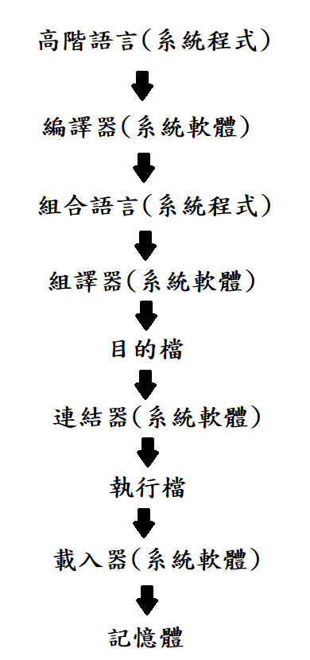

# 第六週上課筆記-理論基礎＋組合語言

## 程式的編譯、組譯、連結及載入流程



```
系統程式: 高階語言、組合語言。
系統軟體: 編譯器、組譯器、連結器、載入器。
```
## 堆疊段

```
#include <stdio.h>
 
int power2(int n){
    if(n==0){
        return 1;
    }
    return power2(n-1)*2;
}

int main(){
    int p=power2(3);
    printf("p=%d\n",p);
}
```
* 直接編譯連結，產生執行檔
```
$ gcc main.c sum.c -o run    //-o:指定輸出檔
$ gcc main.c sum.c           //輸出檔檔名為a.exe(Windows)、a.out(Mac)
```

* 產生組合語言(-S)
```
$ gcc -S main.c -o main.s
```

* 組譯後連結,產生執行檔
```
$ gcc main.c sum.s -o run
```

* 產生目的檔(-c)
```
$ gcc -c sum.c -o sum.o
```

* 連結目的檔,產生執行檔
```
$ gcc main.o sum.o -o run
```

## 其他補充
* [延伸補充教材](https://www.slideshare.net/ccckmit/ss-15898210?fbclid=IwAR2PND1_8cH_epVw7siL_JfUtffbO4o3TsPKhXwzkz6iSy_uA0x38P0koYE)