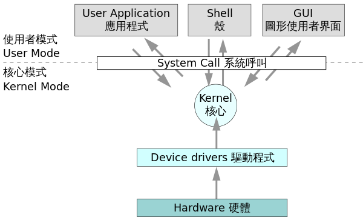
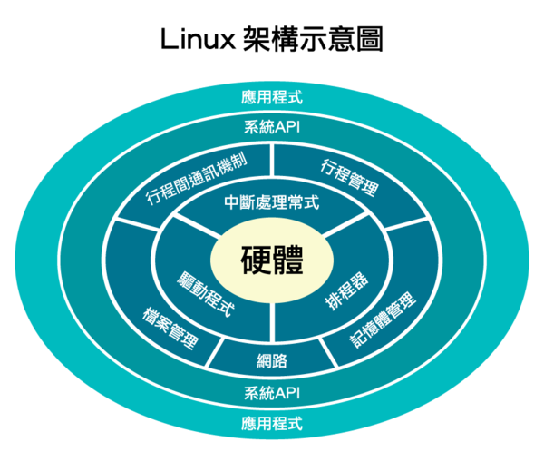
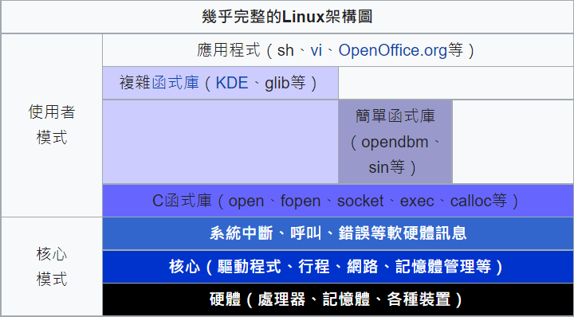
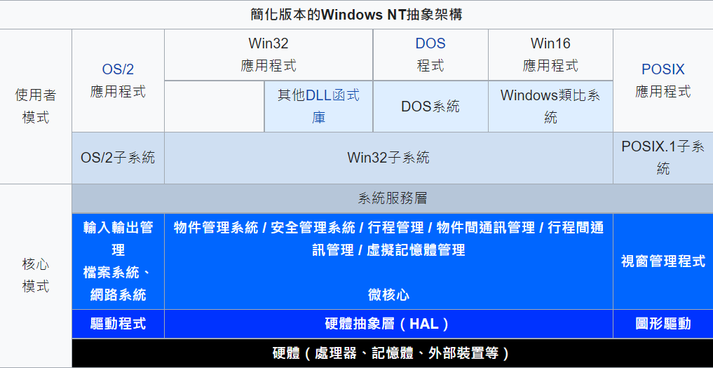

# 期末報告 - 作業系統

## 前言
* 一組主管並控制電腦操作、運用和執行硬體、軟體資源和提供公共服務來組織使用者互動的相互關聯的系統軟體程式。
作業系統需要處理如管理與組態記憶體、決定系統資源供需的優先次序、控制輸入與輸出裝置、操作網路與管理檔案系統等基本事務。
```
許多作業系統製造者對它涵蓋範疇的定義也不盡一致。
例如有些作業系統整合了圖形化使用者介面，而有些僅使用命令列介面，將圖形化使用者介面視為一種非必要的應用程式。
```
# 歷史
### ```1980年代前```

* 第一部電腦並沒有作業系統。
這是由於早期電腦的建立方式與效能不足以執行如此程式。

1947年發明電晶體，及莫里斯·威爾克斯發明--微程式方法，使電腦不再是機械裝置，而是``電子產品``。
系統管理工具及簡化硬體操作流程的程式出現，且成為作業系統的起源。
廠商為每一台不同型號的電腦創造不同的作業系統，``某電腦寫的程式無法移植到其他電腦上執行``，即使是``同型號``的電腦也不行。

1964年，推出了一系列用途與價位都不同的大型電腦，而它們都共享代號為OS/360的作業系統。
讓單一作業系統適用於整個系列的產品是System/360成功的關鍵，且實際上IBM目前的大型系統便是此系統的後裔，為System/360所寫的應用程式依然可以在現代的IBM機器上執行。

OS/360優點：``永久貯存裝置``。
* 關鍵是分時概念的建立：將大型電腦的時間資源適當分配到所有使用者身上。

湯普遜所建立的Unix系統，為了實踐平台移植能力，此作業系統在1973年由C語言重寫；另一個廣為市場採用的小型電腦作業系統是``VMS``。



### ```1980年代 ```

第一代微型電腦，沒有裝設作業系統的需求或能力；它們只需要最```基本```的作業系統，通常這種作業系統都是從```ROM讀取```的，此種程式被稱為``監視程式``。

1980年代，家用電腦開始普及。
80年代早期的套裝電腦--使用微處理器6510的``Commodore C64``，沒有作業系統。
可用8KB唯讀記憶體``BASIC語言``(沒有核心或軟硬體保護機制)來直接操作BIOS，並依此撰寫程式，大部分是``遊戲``。

早期最著名的磁碟啟動型作業系統是CP/M，它支援許多早期的微電腦。最早期的IBM PC其架構類似C64。
BASIC優於其他公司產品的原因在於他有``可攜性``，並且相容於任何``符合IBM PC架構``的機器上。
為了支援更進一步的檔案讀寫概念，磁碟作業系統（Disk Operating System，DOS）因而誕生。
此作業系統可以``合併任意數量的磁區``，因此可以在一張磁碟片上放置任意數量與大小的檔案。檔案之間以檔名區別。


而1980年代另一個作業系統是``Mac OS``，此作業系統緊緊與``麥金塔電腦``綑綁在一起。
* 個人電腦的未來必定屬於``圖形使用者介面``，因此也開始發展自己的圖形化作業系統。


### 　```1990年代 ```

* 由於圖形化使用者介面日趨繁複，作業系統的能力也越來越複雜與巨大，因此強韌且具有彈性的作業系統就成了迫切的需求。

上一年代於市場崛起的蘋果電腦，由於舊系統的設計不良，使得其後繼發展不力，蘋果電腦決定重新設計作業系統。
經過許多失敗的專案後，蘋果於1997年釋出新作業系統--``Mac OS X``的測試版，而後推出的正式版取得了巨大的成功。

除了商業主流的作業系統外，從1980年代在``開放原始碼``的世界中，BSD系統也發展了非常久的一段時間，但在1990年代由於與``AT&T``的法律爭端，使得遠在芬蘭赫爾辛基大學的另一股開源作業系統--``Linux``興起。

* Linux核心是一個標準POSIX核心，其血緣可算是``Unix``家族的一支。
Linux與BSD家族都搭配``GNU``計畫所發展的應用程式，Linux取得了相當可觀的開源作業系統市佔率，而BSD則小得多。
相較於MS-DOS的架構，Linux除了擁有傲人的可移植性，它也是一個分時多行程核心，以及``良好的記憶體空間管理``。
* 因此理論上任何應用程式執行時的錯誤，都不可能讓系統當機。

### ``` 今日 ```

* 現代作業系統通常都有一個使用的繪圖裝置的``圖形化使用者介面``。
舊的OS或效能導向的伺服器通常不會有如此親切的介面，而是以命令列介面加上鍵盤為輸入裝置。以上兩種介面其實都是所謂的殼，其功能為接受並處理使用者的指令。

選擇要安裝的作業系統通常與其硬體架構有很大關係，只有Linux與BSD幾乎可在所有硬體架構上執行，而Windows NT僅移植到了DEC Alpha與MIPS Magnum。在1990年代早期，個人電腦的選擇就已被侷限在Windows家族、類Unix家族以及Linux上，而以Linux及Mac OS X為最主要的另類選擇。

大型機與嵌入式系統使用很多樣化的作業系統。大型主機近期有許多開始支援Java及Linux以便共享其他平台的資源。嵌入式系統近期百家爭鳴，從給Sensor Networks用的Berkeley Tiny OS到可以操作Microsoft Office的Windows CE都有。

# 細項解說
### ```個人電腦```

個人電腦市場目前分為兩大陣營，此兩種架構分別有支援的作業系統：

Apple Macintosh - Mac OS X，Windows（僅Intel平台），Linux、BSD。
IBM相容PC - Windows、Linux、BSD、Mac OS X（非正式支援）。

### ```大型電腦```

最早的作業系統是針對20世紀60年代的大型主結構開發的，由於對這些系統在軟體方面做了巨大投資，因此原來的電腦廠商繼續開發與原來作業系統相容的硬體與作業系統。這些早期的作業系統是現代作業系統的先驅。現在仍被支援的大型主機作業系統包括：

Burroughs MCP-- B5000，1961 to Unisys Clearpath/MCP, present.
IBM OS/360 -- IBM System/360, 1964 to IBM zSeries, present
UNIVAC EXEC 8 -- UNIVAC 1108, 1964, to Unisys Clearpath Dorado, present.
現代的大型主機一般也可執行Linux或Unix變種。

### ```嵌入式```

嵌入式系統使用非常廣泛的系統以及某些功能縮減版本的Linux或者其他作業系統。
某些情況下，OS指稱的是一個內建了固定應用軟體的巨大泛用程式。在許多最簡單的嵌入式系統中，所謂的OS就是指其上唯一的應用程式。

### ```Unix系統的演變```

* KDE SC 4桌面
所謂的類Unix家族指的是一族種類繁多的OS，此族包含了System V、BSD與Linux。
由於Unix是``The Open Group``的註冊商標，特指遵守此公司定義的行為的作業系統。而類Unix通常指的是比原先的Unix包含更多特徵的OS。

某些Unix變種，例如惠普的HP-UX以及IBM的AIX僅設計用於自家的硬體產品上，而SUN的Solaris可安裝於自家的硬體或x86電腦上。
蘋果電腦的Mac OS X是一個從NeXTSTEP、Mach以及FreeBSD共同衍生出來的微核心BSD系統，此OS取代了蘋果電腦早期非Unix家族的Mac OS。

自由開源的Linux系統逐漸蠶食以往``專利軟體``的專業領域，例如以往電腦動畫運算巨擘──矽谷圖形公司的IRIX系統已被Linux家族及Inferno系統取代，皆用於分散運算式環境。
它們並不像其他Unix系統，而是選擇內建圖形化使用者介面。九號計畫原先並不普及，因為它剛推出時並非自由軟體。後來改在自由及開源軟體許可證Lucent Public License釋出後，便開始擁有廣大的使用者及社群。Inferno已被售予Vita Nuova並以GPL/MIT許可證釋出。

* 當前，計算機按照計算能力排名世界500強中472台使用Linux，6台使用Windows，其餘為各類BSD等Unix。


### ```微軟Windows```

Microsoft Windows系列作業系統是在微軟給IBM機器設計的MS-DOS的基礎上設計的``圖形作業系統``。現在的Windows系統。
NT核心是由OS/2和OpenVMS等系統上借用來的。

雖然由於人們對於開放原始碼作業系統興趣的提升，Windows的市場佔有率有所下降，但是到2004年為止，Windows作業系統在世界範圍內佔據了桌面作業系統90%的市場。

Windows系統也被用在``低階``和``中階伺服器``上，並且支援網頁服務的資料庫服務等一些功能。最近微軟花費了很大研究與開發的經費用於使Windows擁有能運行企業的大型程式的能力。

而最新的Windows 10則是於2015年7月29日發售。將 Windows 10 定義為一項服務，而不再是軟體，故之後消費級桌面系統不會有新的名稱，而是延續Windows 10，而每次大更新後就更改版本號，目前最新為20H2。


### ```蘋果macOS```

macOS，前稱「Mac OS X」或「OS X」，是一套執行於蘋果Macintosh系列電腦上的作業系統。
Mac OS是首個在商用領域成功的圖形化使用者介面系統。從OS X 10.8開始在名字中去掉Mac，僅保留OSX和版本號。

2016年6月13日在WWDC2016上，蘋果公司將OS X更名為macOS，現行的最新的系統版本是macOS Catalina。
2020年9月14日，蘋果公司發布最新的系統版本 macOS Big Sur。

### ```Chrome OS```

Google Chrome OS是一項Google的輕型電腦作業系統計劃，其基於Google的瀏覽器Google Chrome的``Linux``核心。

# 作業系統種類
### ``整批處理作業系統``
特色：將欲處理的資料或程式整批集中，置於如卡片、紙帶、磁帶、磁碟等儲存在媒體內，當要處理時，CPU才會到媒體中讀取資料後加以處理。
優點：整批處理作業系統是第一代作業系統，比起沒有作業系統時，更有效地改進了電腦的作業效率，``減少大部份人工操作``的比率。
缺點：因為CPU速度遠較存取資料的I/O為快，所以此方式CPU常``被閒置，效率低``。
### ``分時作業系統``
特色：CPU每次分配給各程序式一段相同的時間，如果該程序式無法在該段時間內完成，都必須離開CPU回到佇列重新排隊等待下一週期再執行
優點：由於電腦CPU的速度實在很快，分時系統上``連線的各個終端機``，縱使和主機相隔甚遠，仍然可以很快地處理各項訊息並傳回結果；並無等待的感覺，達到人和電腦相互交談的效果。
缺點：由於CPU是各``程序式共享``的，因此一旦遇到很大的程序式，又有急迫的時效性時，分時系統將無法達成。
### ``交談式作業系統``
特色：將所有資料都儲存在能由CPU直接控制的儲存設備內，遇有優先次序高的程序式時，CPU立即全力加以處理，在最短的時間內輸出結果完成任務。
交談式系統屬於立即執行的觀念，可以和各個終端機連線，通常會排定一個優先次序，優先權愈高的程序式可以被優先即時處理。
### ``多工處理作業系統``
特色：以``兩個或兩個以上同型``的CPU，以並行處理的方式，去處理一個或一個以上的程序式稱為``多工處理``。
多工處理作業系統可以在同一時間完成許多程式的處理工作。也可以由多個CPU去執行同一程式，並相互比較核對執行結果的正確性。
### ``網路式作業系統``
特色：透過通信傳輸線路使分散在各地的電腦能夠互相傳遞訊息，共享資源。
網路依其連線範圍的大小分為區域網路

### ``和廣域網路``
特點：網路已廣泛的應用在各方面，因此網路式作業系統變得非常重要。
例如:教學電腦網路、行政電腦網路、通訊網路
個人電腦作業系統的種類